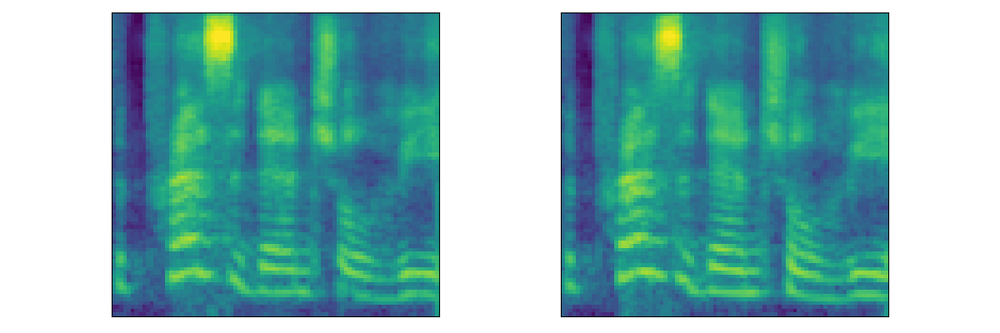
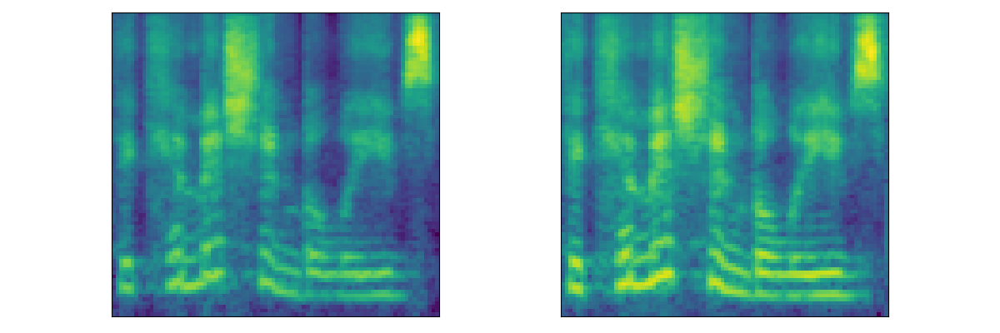
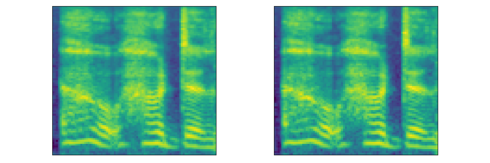
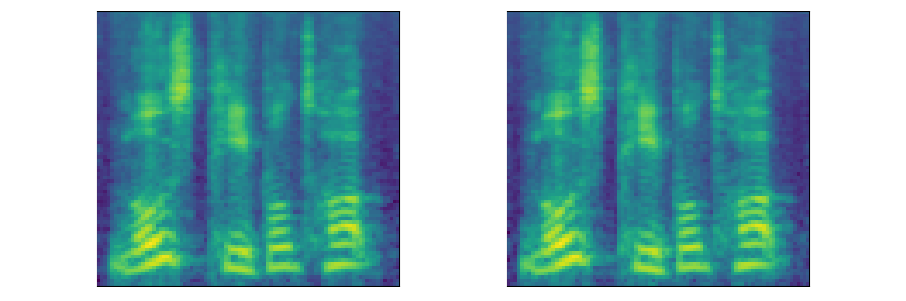
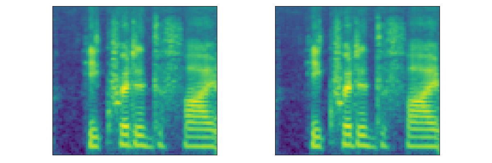
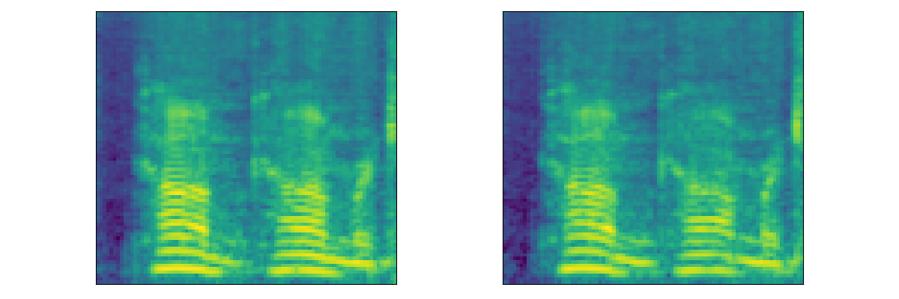
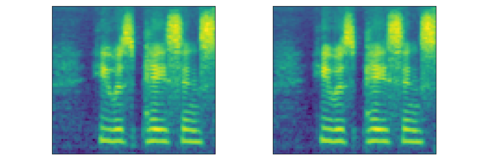
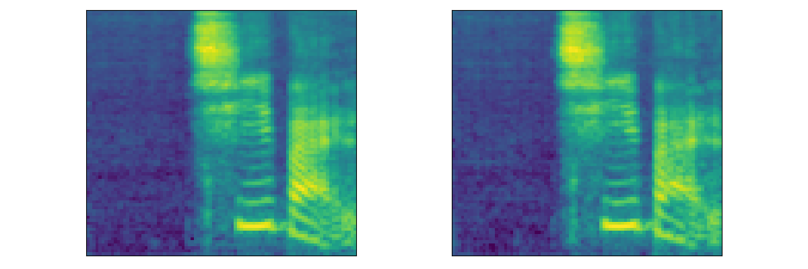

{:.no_toc}
* toc
{:toc}

# Groot: Generating Robust Watermark for Diffusion-Model-Based Audio Synthesis

## Author
Weizhi Liu<sup>1</sup>, Yue Li<sup>1</sup>, Dongdong Lin<sup>2</sup>, Hui Tian<sup>1</sup>, Haizhou Li<sup>3</sup>.

<sup>1</sup>Huaqiao University and Xiamen Key Laboratory of Data Security and Blockchain Technology, Xiamen, China.

<sup>2</sup>Shenzhen University, Shenzhen, China.

<sup>3</sup>The Chinese University of Hong Kong, Shenzhen, China.

## Abstract
Amid the burgeoning development of generative models like diffusion models, the task of differentiating synthesized audio from its natural counterpart grows more daunting. Deepfake detection offers a viable solution to combat this challenge. Yet, this defensive measure unintentionally fuels the continued refinement of generative models. Watermarking emerges as a proactive and sustainable tactic, preemptively regulating the creation and dissemination of synthesized content. Thus, this paper, as a pioneer, proposes the generative robust audio watermarking method (Groot), presenting a paradigm for proactively supervising the synthesized audio and its source diffusion models. In this paradigm, the processes of watermark generation and audio synthesis occur simultaneously, facilitated by parameter-fixed diffusion models equipped with a dedicated encoder. The watermark embedded within the audio can subsequently be retrieved by a lightweight decoder. The experimental results highlight Groot's outstanding performance, particularly in terms of robustness, surpassing that of the leading state-of-the-art methods. Beyond its impressive resilience against individual post-processing attacks, Groot exhibits exceptional robustness when facing compound attacks, maintaining an average watermark extraction accuracy of around 95%.

## Pipeline of Groot


## Audio Demo
### Single-Speaker English Dataset (<strong>LJSpeech</strong>)

<table>
  <thead>
     <th style="text-align: center"><strong><em>DiffWave<sup>[1]</sup></em></strong></th>
     <th style="text-align: center">Demo1</th>
     <th style="text-align: center">Demo2</th>
     <th style="text-align: center">Demo3</th>
     <th style="text-align: center">Demo4</th>
     <th style="text-align: center">Demo5</th>
  </thead>
  <tbody>
    <tr>
      <th>Generated</th>
      <td style="text-align: center"><audio controls style="width: 150px;"><source src="audio/ljs/ljs_generated1.wav" type="audio/wav"></audio></td>
      <td style="text-align: center"><audio controls style="width: 150px;"><source src="audio/ljs/ljs_generated2.wav" type="audio/wav"></audio></td>
      <td style="text-align: center"><audio controls style="width: 150px;"><source src="audio/ljs/ljs_generated3.wav" type="audio/wav"></audio></td>
      <td style="text-align: center"><audio controls style="width: 150px;"><source src="audio/ljs/ljs_generated4.wav" type="audio/wav"></audio></td>
      <td style="text-align: center"><audio controls style="width: 150px;"><source src="audio/ljs/ljs_generated5.wav" type="audio/wav"></audio></td>
    </tr>
  </tbody>
  <tbody>
    <tr>
      <th>Watermarked</th>
      <td style="text-align: center"><audio controls style="width: 150px;"><source src="audio/ljs/ljs_watermarked1.wav" type="audio/wav"></audio></td>
      <td style="text-align: center"><audio controls style="width: 150px;"><source src="audio/ljs/ljs_watermarked2.wav" type="audio/wav"></audio></td>
      <td style="text-align: center"><audio controls style="width: 150px;"><source src="audio/ljs/ljs_watermarked3.wav" type="audio/wav"></audio></td>
      <td style="text-align: center"><audio controls style="width: 150px;"><source src="audio/ljs/ljs_watermarked4.wav" type="audio/wav"></audio></td>
      <td style="text-align: center"><audio controls style="width: 150px;"><source src="audio/ljs/ljs_watermarked5.wav" type="audio/wav"></audio></td>
    </tr>
  </tbody>
  <tbody>
    <tr>
      <th>Mel</th>
      <td style="text-align: center"></td>
      <td style="text-align: center"></td>
      <td style="text-align: center"></td>
      <td style="text-align: center"></td>
      <td style="text-align: center"></td>
    </tr>
  </tbody>
</table>

<table>
  <thead>
     <th style="text-align: center"><strong><em>WaveGrad<sup>[2]</sup></em></strong></th>
     <th style="text-align: center">Demo1</th>
     <th style="text-align: center">Demo2</th>
     <th style="text-align: center">Demo3</th>
     <th style="text-align: center">Demo4</th>
     <th style="text-align: center">Demo5</th>
  </thead>
  <tbody>
    <tr>
      <th>Generated</th>
      <td style="text-align: center"><audio controls style="width: 150px;"><source src="audio/wavegrad/ljs_generated1.wav" type="audio/wav"></audio></td>
      <td style="text-align: center"><audio controls style="width: 150px;"><source src="audio/wavegrad/ljs_generated2.wav" type="audio/wav"></audio></td>
      <td style="text-align: center"><audio controls style="width: 150px;"><source src="audio/wavegrad/ljs_generated3.wav" type="audio/wav"></audio></td>
      <td style="text-align: center"><audio controls style="width: 150px;"><source src="audio/wavegrad/ljs_generated4.wav" type="audio/wav"></audio></td>
      <td style="text-align: center"><audio controls style="width: 150px;"><source src="audio/wavegrad/ljs_generated5.wav" type="audio/wav"></audio></td>
    </tr>
  </tbody>
  <tbody>
    <tr>
      <th>Watermarked</th>
      <td style="text-align: center"><audio controls style="width: 150px;"><source src="audio/wavegrad/ljs_watermarked1.wav" type="audio/wav"></audio></td>
      <td style="text-align: center"><audio controls style="width: 150px;"><source src="audio/wavegrad/ljs_watermarked2.wav" type="audio/wav"></audio></td>
      <td style="text-align: center"><audio controls style="width: 150px;"><source src="audio/wavegrad/ljs_watermarked3.wav" type="audio/wav"></audio></td>
      <td style="text-align: center"><audio controls style="width: 150px;"><source src="audio/wavegrad/ljs_watermarked4.wav" type="audio/wav"></audio></td>
      <td style="text-align: center"><audio controls style="width: 150px;"><source src="audio/wavegrad/ljs_watermarked5.wav" type="audio/wav"></audio></td>
    </tr>
  </tbody>
  <tbody>
    <tr>
      <th>Mel</th>
      <td style="text-align: center"></td>
      <td style="text-align: center"></td>
      <td style="text-align: center"></td>
      <td style="text-align: center"></td>
      <td style="text-align: center"></td>
    </tr>
  </tbody>
</table>

<table>
  <thead>
     <th style="text-align: center"><strong><em>PriorGrad<sup>[3]</sup></em></strong></th>
     <th style="text-align: center">Demo1</th>
     <th style="text-align: center">Demo2</th>
     <th style="text-align: center">Demo3</th>
     <th style="text-align: center">Demo4</th>
     <th style="text-align: center">Demo5</th>
  </thead>
  <tbody>
    <tr>
      <th>Generated</th>
      <td style="text-align: center"><audio controls style="width: 150px;"><source src="audio/priorgrad/ljs_generated1.wav" type="audio/wav"></audio></td>
      <td style="text-align: center"><audio controls style="width: 150px;"><source src="audio/priorgrad/ljs_generated2.wav" type="audio/wav"></audio></td>
      <td style="text-align: center"><audio controls style="width: 150px;"><source src="audio/priorgrad/ljs_generated3.wav" type="audio/wav"></audio></td>
      <td style="text-align: center"><audio controls style="width: 150px;"><source src="audio/priorgrad/ljs_generated4.wav" type="audio/wav"></audio></td>
      <td style="text-align: center"><audio controls style="width: 150px;"><source src="audio/priorgrad/ljs_generated5.wav" type="audio/wav"></audio></td>
    </tr>
  </tbody>
  <tbody>
    <tr>
      <th>Watermarked</th>
      <td style="text-align: center"><audio controls style="width: 150px;"><source src="audio/priorgrad/ljs_watermarked1.wav" type="audio/wav"></audio></td>
      <td style="text-align: center"><audio controls style="width: 150px;"><source src="audio/priorgrad/ljs_watermarked2.wav" type="audio/wav"></audio></td>
      <td style="text-align: center"><audio controls style="width: 150px;"><source src="audio/priorgrad/ljs_watermarked3.wav" type="audio/wav"></audio></td>
      <td style="text-align: center"><audio controls style="width: 150px;"><source src="audio/priorgrad/ljs_watermarked4.wav" type="audio/wav"></audio></td>
      <td style="text-align: center"><audio controls style="width: 150px;"><source src="audio/priorgrad/ljs_watermarked5.wav" type="audio/wav"></audio></td>
    </tr>
  </tbody>
  <tbody>
    <tr>
      <th>Mel</th>
      <td style="text-align: center"></td>
      <td style="text-align: center"></td>
      <td style="text-align: center"></td>
      <td style="text-align: center"></td>
      <td style="text-align: center"></td>
    </tr>
  </tbody>
</table>


### Multi-Speaker English Dataset (<strong>LibriTTS</strong>)
<table>
  <thead>
     <th style="text-align: center"><em>DiffWave</em></th>
     <th style="text-align: center">Speaker1</th>
     <th style="text-align: center">Speaker2</th>
     <th style="text-align: center">Speaker3</th>
     <th style="text-align: center">Speaker4</th>
     <th style="text-align: center">Speaker5</th>
  </thead>
  <tbody>
    <tr>
      <th>Generated</th>
      <td style="text-align: center"><audio controls style="width: 150px;"><source src="audio/lts/lts_generated1.wav" type="audio/wav"></audio></td>
      <td style="text-align: center"><audio controls style="width: 150px;"><source src="audio/lts/lts_generated2.wav" type="audio/wav"></audio></td>
      <td style="text-align: center"><audio controls style="width: 150px;"><source src="audio/lts/lts_generated3.wav" type="audio/wav"></audio></td>
      <td style="text-align: center"><audio controls style="width: 150px;"><source src="audio/lts/lts_generated4.wav" type="audio/wav"></audio></td>
      <td style="text-align: center"><audio controls style="width: 150px;"><source src="audio/lts/lts_generated5.wav" type="audio/wav"></audio></td>
    </tr>
  </tbody>
  <tbody>
    <tr>
      <th>Watermarked</th>
      <td style="text-align: center"><audio controls style="width: 150px;"><source src="audio/lts/lts_watermarked1.wav" type="audio/wav"></audio></td>
      <td style="text-align: center"><audio controls style="width: 150px;"><source src="audio/lts/lts_watermarked2.wav" type="audio/wav"></audio></td>
      <td style="text-align: center"><audio controls style="width: 150px;"><source src="audio/lts/lts_watermarked3.wav" type="audio/wav"></audio></td>
      <td style="text-align: center"><audio controls style="width: 150px;"><source src="audio/lts/lts_watermarked4.wav" type="audio/wav"></audio></td>
      <td style="text-align: center"><audio controls style="width: 150px;"><source src="audio/lts/lts_watermarked5.wav" type="audio/wav"></audio></td>
    </tr>
  </tbody>
  <tbody>
    <tr>
      <th>Mel</th>
      <td style="text-align: center"></td>
      <td style="text-align: center"></td>
      <td style="text-align: center"></td>
      <td style="text-align: center"></td>
      <td style="text-align: center"></td>
    </tr>
  </tbody>
</table>


### Multi-Speaker English Dataset (<strong>LibriSpeech</strong>)
<table>
  <thead>
     <th style="text-align: center"><em>DiffWave</em></th>
     <th style="text-align: center">Speaker1</th>
     <th style="text-align: center">Speaker2</th>
     <th style="text-align: center">Speaker3</th>
     <th style="text-align: center">Speaker4</th>
     <th style="text-align: center">Speaker5</th>
  </thead>
  <tbody>
    <tr>
      <th>Generated</th>
      <td style="text-align: center"><audio controls style="width: 150px;"><source src="audio/lbs/lbs_generated1.wav" type="audio/wav"></audio></td>
      <td style="text-align: center"><audio controls style="width: 150px;"><source src="audio/lbs/lbs_generated2.wav" type="audio/wav"></audio></td>
      <td style="text-align: center"><audio controls style="width: 150px;"><source src="audio/lbs/lbs_generated3.wav" type="audio/wav"></audio></td>
      <td style="text-align: center"><audio controls style="width: 150px;"><source src="audio/lbs/lbs_generated4.wav" type="audio/wav"></audio></td>
      <td style="text-align: center"><audio controls style="width: 150px;"><source src="audio/lbs/lbs_generated5.wav" type="audio/wav"></audio></td>
    </tr>
  </tbody>
  <tbody>
    <tr>
      <th>Watermarked</th>
      <td style="text-align: center"><audio controls style="width: 150px;"><source src="audio/lbs/lbs_watermarked1.wav" type="audio/wav"></audio></td>
      <td style="text-align: center"><audio controls style="width: 150px;"><source src="audio/lbs/lbs_watermarked2.wav" type="audio/wav"></audio></td>
      <td style="text-align: center"><audio controls style="width: 150px;"><source src="audio/lbs/lbs_watermarked3.wav" type="audio/wav"></audio></td>
      <td style="text-align: center"><audio controls style="width: 150px;"><source src="audio/lbs/lbs_watermarked4.wav" type="audio/wav"></audio></td>
      <td style="text-align: center"><audio controls style="width: 150px;"><source src="audio/lbs/lbs_watermarked5.wav" type="audio/wav"></audio></td>
    </tr>
  </tbody>
  <tbody>
    <tr>
      <th>Mel</th>
      <td style="text-align: center"></td>
      <td style="text-align: center"></td>
      <td style="text-align: center"></td>
      <td style="text-align: center"></td>
      <td style="text-align: center"></td>
    </tr>
  </tbody>
</table>


### Multi-Speaker Chinese Dataset (<strong>Aishell3</strong>)
<table>
  <thead>
     <th style="text-align: center"><em>DiffWave</em></th>
     <th style="text-align: center">Speaker1</th>
     <th style="text-align: center">Speaker2</th>
     <th style="text-align: center">Speaker3</th>
     <th style="text-align: center">Speaker4</th>
     <th style="text-align: center">Speaker5</th>
  </thead>
  <tbody>
    <tr>
      <th>Generated</th>
      <td style="text-align: center"><audio controls style="width: 150px;"><source src="audio/asl/asl_generated1.wav" type="audio/wav"></audio></td>
      <td style="text-align: center"><audio controls style="width: 150px;"><source src="audio/asl/asl_generated2.wav" type="audio/wav"></audio></td>
      <td style="text-align: center"><audio controls style="width: 150px;"><source src="audio/asl/asl_generated3.wav" type="audio/wav"></audio></td>
      <td style="text-align: center"><audio controls style="width: 150px;"><source src="audio/asl/asl_generated4.wav" type="audio/wav"></audio></td>
      <td style="text-align: center"><audio controls style="width: 150px;"><source src="audio/asl/asl_generated5.wav" type="audio/wav"></audio></td>
    </tr>
  </tbody>
  <tbody>
    <tr>
      <th>Watermarked</th>
      <td style="text-align: center"><audio controls style="width: 150px;"><source src="audio/asl/asl_watermarked1.wav" type="audio/wav"></audio></td>
      <td style="text-align: center"><audio controls style="width: 150px;"><source src="audio/asl/asl_watermarked2.wav" type="audio/wav"></audio></td>
      <td style="text-align: center"><audio controls style="width: 150px;"><source src="audio/asl/asl_watermarked3.wav" type="audio/wav"></audio></td>
      <td style="text-align: center"><audio controls style="width: 150px;"><source src="audio/asl/asl_watermarked4.wav" type="audio/wav"></audio></td>
      <td style="text-align: center"><audio controls style="width: 150px;"><source src="audio/asl/asl_watermarked5.wav" type="audio/wav"></audio></td>
    </tr>
  </tbody>
  <tbody>
    <tr>
      <th>Mel</th>
      <td style="text-align: center"></td>
      <td style="text-align: center"></td>
      <td style="text-align: center"></td>
      <td style="text-align: center"></td>
      <td style="text-align: center"></td>
    </tr>
  </tbody>
</table>

### Reference
1. Kong Z, Ping W, Huang J, et al. DiffWave: A Versatile Diffusion Model for Audio Synthesis[C]//International Conference on Learning Representations. 2021.
2. Chen N, Zhang Y, Zen H, et al. WaveGrad: Estimating Gradients for Waveform Generation[C]//International Conference on Learning Representations. 2021.
3. Lee S, Kim H, Shin C, et al. PriorGrad: Improving Conditional Denoising Diffusion Models with Data-Dependent Adaptive Prior[C]//International Conference on Learning Representations. 2022.

### 😊 Citation

If you find the code and dataset useful in your research, please consider citing our paper:
```
@inproceedings{liu2024groot,
  title={GROOT: Generating Robust Watermark for Diffusion-Model-Based Audio Synthesis},
  author={Liu, Weizhi and Li, Yue and Lin, Dongdong and Tian, Hui and Li, Haizhou},
  booktitle={Proceedings of the 31st ACM International Conference on Multimedia},
  year={2024}
}
```


