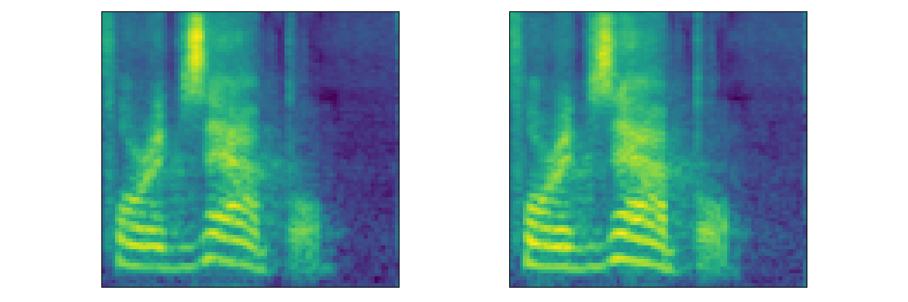
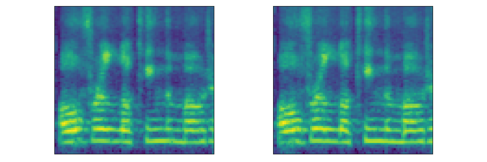
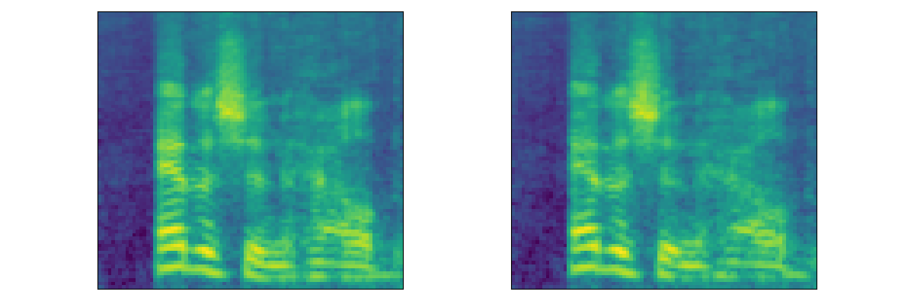
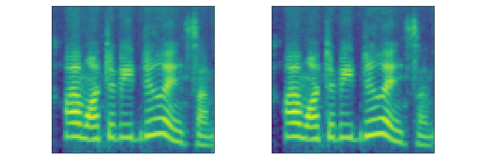
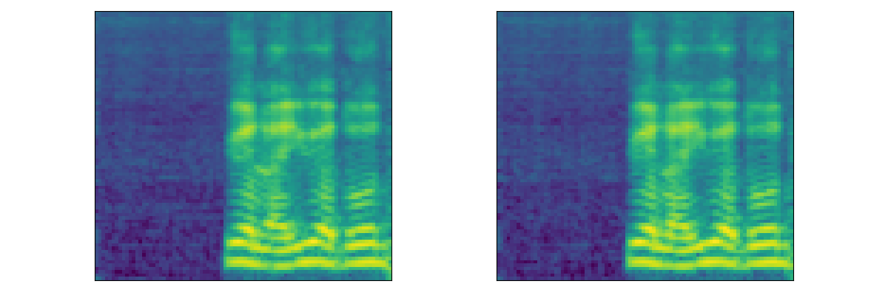

{:.no_toc}
* toc
{:toc}

# Groot: Generating Robust Watermark for Diffusion-Model-Based Audio Synthesis

## Abstract

## Overview

## Audio Demo
### Single-Speaker English Dataset (LJSpeech)

<table>
  <thead>
     <th style="text-align: center"><strong><em>DiffWave[1]</em></strong></th>
     <th style="text-align: center">Demo1</th>
     <th style="text-align: center">Demo2</th>
     <th style="text-align: center">Demo3</th>
     <th style="text-align: center">Demo4</th>
     <th style="text-align: center">Demo5</th>
  </thead>
  <tbody>
    <tr>
      <th>Generated</th>
      <td style="text-align: center"><audio controls style="width: 150px;"><source src="audio/ljs/ljs_generated1.wav" type="audio/wav"></audio></td>
      <td style="text-align: center"><audio controls style="width: 150px;"><source src="audio/ljs/ljs_generated2.wav" type="audio/wav"></audio></td>
      <td style="text-align: center"><audio controls style="width: 150px;"><source src="audio/ljs/ljs_generated3.wav" type="audio/wav"></audio></td>
      <td style="text-align: center"><audio controls style="width: 150px;"><source src="audio/ljs/ljs_generated4.wav" type="audio/wav"></audio></td>
      <td style="text-align: center"><audio controls style="width: 150px;"><source src="audio/ljs/ljs_generated5.wav" type="audio/wav"></audio></td>
    </tr>
  </tbody>
  <tbody>
    <tr>
      <th>Watermarked</th>
      <td style="text-align: center"><audio controls style="width: 150px;"><source src="audio/ljs/ljs_watermarked1.wav" type="audio/wav"></audio></td>
      <td style="text-align: center"><audio controls style="width: 150px;"><source src="audio/ljs/ljs_watermarked2.wav" type="audio/wav"></audio></td>
      <td style="text-align: center"><audio controls style="width: 150px;"><source src="audio/ljs/ljs_watermarked3.wav" type="audio/wav"></audio></td>
      <td style="text-align: center"><audio controls style="width: 150px;"><source src="audio/ljs/ljs_watermarked4.wav" type="audio/wav"></audio></td>
      <td style="text-align: center"><audio controls style="width: 150px;"><source src="audio/ljs/ljs_watermarked5.wav" type="audio/wav"></audio></td>
    </tr>
  </tbody>
  <tbody>
    <tr>
      <th>Mel</th>
      <td style="text-align: center"></td>
      <td style="text-align: center"></td>
      <td style="text-align: center"></td>
      <td style="text-align: center"></td>
      <td style="text-align: center"></td>
    </tr>
  </tbody>
</table>

<table>
  <thead>
     <th style="text-align: center"><strong><em>WaveGrad[2]</em></strong></th>
     <th style="text-align: center">Demo1</th>
     <th style="text-align: center">Demo2</th>
     <th style="text-align: center">Demo3</th>
     <th style="text-align: center">Demo4</th>
     <th style="text-align: center">Demo5</th>
  </thead>
  <tbody>
    <tr>
      <th>Generated</th>
      <td style="text-align: center"><audio controls style="width: 150px;"><source src="audio/wavegrad/ljs_generated1.wav" type="audio/wav"></audio></td>
      <td style="text-align: center"><audio controls style="width: 150px;"><source src="audio/wavegrad/ljs_generated2.wav" type="audio/wav"></audio></td>
      <td style="text-align: center"><audio controls style="width: 150px;"><source src="audio/wavegrad/ljs_generated3.wav" type="audio/wav"></audio></td>
      <td style="text-align: center"><audio controls style="width: 150px;"><source src="audio/wavegrad/ljs_generated4.wav" type="audio/wav"></audio></td>
      <td style="text-align: center"><audio controls style="width: 150px;"><source src="audio/wavegrad/ljs_generated5.wav" type="audio/wav"></audio></td>
    </tr>
  </tbody>
  <tbody>
    <tr>
      <th>Watermarked</th>
      <td style="text-align: center"><audio controls style="width: 150px;"><source src="audio/wavegrad/ljs_watermarked1.wav" type="audio/wav"></audio></td>
      <td style="text-align: center"><audio controls style="width: 150px;"><source src="audio/wavegrad/ljs_watermarked2.wav" type="audio/wav"></audio></td>
      <td style="text-align: center"><audio controls style="width: 150px;"><source src="audio/wavegrad/ljs_watermarked3.wav" type="audio/wav"></audio></td>
      <td style="text-align: center"><audio controls style="width: 150px;"><source src="audio/wavegrad/ljs_watermarked4.wav" type="audio/wav"></audio></td>
      <td style="text-align: center"><audio controls style="width: 150px;"><source src="audio/wavegrad/ljs_watermarked5.wav" type="audio/wav"></audio></td>
    </tr>
  </tbody>
  <tbody>
    <tr>
      <th>Mel</th>
      <td style="text-align: center"></td>
      <td style="text-align: center"></td>
      <td style="text-align: center"></td>
      <td style="text-align: center"></td>
      <td style="text-align: center"></td>
    </tr>
  </tbody>
</table>

<table>
  <thead>
     <th style="text-align: center"><strong><em>PriorGrad[3]</em></strong></th>
     <th style="text-align: center">Demo1</th>
     <th style="text-align: center">Demo2</th>
     <th style="text-align: center">Demo3</th>
     <th style="text-align: center">Demo4</th>
     <th style="text-align: center">Demo5</th>
  </thead>
  <tbody>
    <tr>
      <th>Generated</th>
      <td style="text-align: center"><audio controls style="width: 150px;"><source src="audio/priorgrad/ljs_generated1.wav" type="audio/wav"></audio></td>
      <td style="text-align: center"><audio controls style="width: 150px;"><source src="audio/priorgrad/ljs_generated2.wav" type="audio/wav"></audio></td>
      <td style="text-align: center"><audio controls style="width: 150px;"><source src="audio/priorgrad/ljs_generated3.wav" type="audio/wav"></audio></td>
      <td style="text-align: center"><audio controls style="width: 150px;"><source src="audio/priorgrad/ljs_generated4.wav" type="audio/wav"></audio></td>
      <td style="text-align: center"><audio controls style="width: 150px;"><source src="audio/priorgrad/ljs_generated5.wav" type="audio/wav"></audio></td>
    </tr>
  </tbody>
  <tbody>
    <tr>
      <th>Watermarked</th>
      <td style="text-align: center"><audio controls style="width: 150px;"><source src="audio/priorgrad/ljs_watermarked1.wav" type="audio/wav"></audio></td>
      <td style="text-align: center"><audio controls style="width: 150px;"><source src="audio/priorgrad/ljs_watermarked2.wav" type="audio/wav"></audio></td>
      <td style="text-align: center"><audio controls style="width: 150px;"><source src="audio/priorgrad/ljs_watermarked3.wav" type="audio/wav"></audio></td>
      <td style="text-align: center"><audio controls style="width: 150px;"><source src="audio/priorgrad/ljs_watermarked4.wav" type="audio/wav"></audio></td>
      <td style="text-align: center"><audio controls style="width: 150px;"><source src="audio/priorgrad/ljs_watermarked5.wav" type="audio/wav"></audio></td>
    </tr>
  </tbody>
  <tbody>
    <tr>
      <th>Mel</th>
      <td style="text-align: center"></td>
      <td style="text-align: center"></td>
      <td style="text-align: center"></td>
      <td style="text-align: center"></td>
      <td style="text-align: center"></td>
    </tr>
  </tbody>
</table>

### Multi-Speaker English Dataset (<strong>LibriTTS</strong>)
<table>
  <thead>
     <th style="text-align: center"><em>DiffWave</em></th>
     <th style="text-align: center">Speaker1</th>
     <th style="text-align: center">Speaker2</th>
     <th style="text-align: center">Speaker3</th>
     <th style="text-align: center">Speaker4</th>
     <th style="text-align: center">Speaker5</th>
  </thead>
  <tbody>
    <tr>
      <th>Generated</th>
      <td style="text-align: center"><audio controls style="width: 150px;"><source src="audio/lts/lts_generated1.wav" type="audio/wav"></audio></td>
      <td style="text-align: center"><audio controls style="width: 150px;"><source src="audio/lts/lts_generated2.wav" type="audio/wav"></audio></td>
      <td style="text-align: center"><audio controls style="width: 150px;"><source src="audio/lts/lts_generated3.wav" type="audio/wav"></audio></td>
      <td style="text-align: center"><audio controls style="width: 150px;"><source src="audio/lts/lts_generated4.wav" type="audio/wav"></audio></td>
      <td style="text-align: center"><audio controls style="width: 150px;"><source src="audio/lts/lts_generated5.wav" type="audio/wav"></audio></td>
    </tr>
  </tbody>
  <tbody>
    <tr>
      <th>Watermarked</th>
      <td style="text-align: center"><audio controls style="width: 150px;"><source src="audio/lts/lts_watermarked1.wav" type="audio/wav"></audio></td>
      <td style="text-align: center"><audio controls style="width: 150px;"><source src="audio/lts/lts_watermarked2.wav" type="audio/wav"></audio></td>
      <td style="text-align: center"><audio controls style="width: 150px;"><source src="audio/lts/lts_watermarked3.wav" type="audio/wav"></audio></td>
      <td style="text-align: center"><audio controls style="width: 150px;"><source src="audio/lts/lts_watermarked4.wav" type="audio/wav"></audio></td>
      <td style="text-align: center"><audio controls style="width: 150px;"><source src="audio/lts/lts_watermarked5.wav" type="audio/wav"></audio></td>
    </tr>
  </tbody>
  <tbody>
    <tr>
      <th>Mel</th>
      <td style="text-align: center"></td>
      <td style="text-align: center"></td>
      <td style="text-align: center"></td>
      <td style="text-align: center"></td>
      <td style="text-align: center"></td>
    </tr>
  </tbody>
</table>

### Multi-Speaker English Dataset (<strong>LibriSpeech</strong>)
<table>
  <thead>
     <th style="text-align: center"><em>DiffWave</em></th>
     <th style="text-align: center">Speaker1</th>
     <th style="text-align: center">Speaker2</th>
     <th style="text-align: center">Speaker3</th>
     <th style="text-align: center">Speaker4</th>
     <th style="text-align: center">Speaker5</th>
  </thead>
  <tbody>
    <tr>
      <th>Generated</th>
      <td style="text-align: center"><audio controls style="width: 150px;"><source src="audio/lbs/lbs_generated1.wav" type="audio/wav"></audio></td>
      <td style="text-align: center"><audio controls style="width: 150px;"><source src="audio/lbs/lbs_generated2.wav" type="audio/wav"></audio></td>
      <td style="text-align: center"><audio controls style="width: 150px;"><source src="audio/lbs/lbs_generated3.wav" type="audio/wav"></audio></td>
      <td style="text-align: center"><audio controls style="width: 150px;"><source src="audio/lbs/lbs_generated4.wav" type="audio/wav"></audio></td>
      <td style="text-align: center"><audio controls style="width: 150px;"><source src="audio/lbs/lbs_generated5.wav" type="audio/wav"></audio></td>
    </tr>
  </tbody>
  <tbody>
    <tr>
      <th>Watermarked</th>
      <td style="text-align: center"><audio controls style="width: 150px;"><source src="audio/lbs/lbs_watermarked1.wav" type="audio/wav"></audio></td>
      <td style="text-align: center"><audio controls style="width: 150px;"><source src="audio/lbs/lbs_watermarked2.wav" type="audio/wav"></audio></td>
      <td style="text-align: center"><audio controls style="width: 150px;"><source src="audio/lbs/lbs_watermarked3.wav" type="audio/wav"></audio></td>
      <td style="text-align: center"><audio controls style="width: 150px;"><source src="audio/lbs/lbs_watermarked4.wav" type="audio/wav"></audio></td>
      <td style="text-align: center"><audio controls style="width: 150px;"><source src="audio/lbs/lbs_watermarked5.wav" type="audio/wav"></audio></td>
    </tr>
  </tbody>
  <tbody>
    <tr>
      <th>Mel</th>
      <td style="text-align: center"></td>
      <td style="text-align: center"></td>
      <td style="text-align: center"></td>
      <td style="text-align: center"></td>
      <td style="text-align: center"></td>
    </tr>
  </tbody>
</table>

### Multi-Speaker Chinese Dataset (<strong>Aishell3</strong>)
<table>
  <thead>
     <th style="text-align: center"><em>DiffWave</em></th>
     <th style="text-align: center">Speaker1</th>
     <th style="text-align: center">Speaker2</th>
     <th style="text-align: center">Speaker3</th>
     <th style="text-align: center">Speaker4</th>
     <th style="text-align: center">Speaker5</th>
  </thead>
  <tbody>
    <tr>
      <th>Generated</th>
      <td style="text-align: center"><audio controls style="width: 150px;"><source src="audio/asl/asl_generated1.wav" type="audio/wav"></audio></td>
      <td style="text-align: center"><audio controls style="width: 150px;"><source src="audio/asl/asl_generated2.wav" type="audio/wav"></audio></td>
      <td style="text-align: center"><audio controls style="width: 150px;"><source src="audio/asl/asl_generated3.wav" type="audio/wav"></audio></td>
      <td style="text-align: center"><audio controls style="width: 150px;"><source src="audio/asl/asl_generated4.wav" type="audio/wav"></audio></td>
      <td style="text-align: center"><audio controls style="width: 150px;"><source src="audio/asl/asl_generated5.wav" type="audio/wav"></audio></td>
    </tr>
  </tbody>
  <tbody>
    <tr>
      <th>Watermarked</th>
      <td style="text-align: center"><audio controls style="width: 150px;"><source src="audio/asl/asl_watermarked1.wav" type="audio/wav"></audio></td>
      <td style="text-align: center"><audio controls style="width: 150px;"><source src="audio/asl/asl_watermarked2.wav" type="audio/wav"></audio></td>
      <td style="text-align: center"><audio controls style="width: 150px;"><source src="audio/asl/asl_watermarked3.wav" type="audio/wav"></audio></td>
      <td style="text-align: center"><audio controls style="width: 150px;"><source src="audio/asl/asl_watermarked4.wav" type="audio/wav"></audio></td>
      <td style="text-align: center"><audio controls style="width: 150px;"><source src="audio/asl/asl_watermarked5.wav" type="audio/wav"></audio></td>
    </tr>
  </tbody>
  <tbody>
    <tr>
      <th>Mel</th>
      <td style="text-align: center"></td>
      <td style="text-align: center"></td>
      <td style="text-align: center"></td>
      <td style="text-align: center"></td>
      <td style="text-align: center"></td>
    </tr>
  </tbody>
</table>

### Reference
1. Kong Z, Ping W, Huang J, et al. DiffWave: A Versatile Diffusion Model for Audio Synthesis[C]//International Conference on Learning Representations. 2021.
2. Chen N, Zhang Y, Zen H, et al. WaveGrad: Estimating Gradients for Waveform Generation[C]//International Conference on Learning Representations. 2021.
3. Lee S, Kim H, Shin C, et al. PriorGrad: Improving Conditional Denoising Diffusion Models with Data-Dependent Adaptive Prior[C]//International Conference on Learning Representations. 2022.

